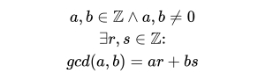

# Bezout Theorem
## Definition


#### LaTex code
```latex
a, b \in \mathbb{Z} \wedge a,b \neq 0 \\
\exists r,s \in \mathbb{Z}\text{:} \\
gcd(a, b) = ar + bs
```

## How it was implemented?
The algorithm to find the Bezout Theorem values is [here](../extended_euclidean_algorithm)
