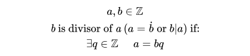

# Divisors
## Definition


#### LaTex code
```latex
a,b \in \mathbb{Z} \\
\textit{b}\text{ is divisor of }\textit{a }\text{(}a=\dot{b} \text{ or } b | a\text{) if:} \\
\exists q \in \mathbb{Z} \hspace{.5cm} a = bq
```
## How it was implemented?
To implement this feature, we used the code from [integer_division](../integer_division), when the `r` is 0,
then b is a divisor:

