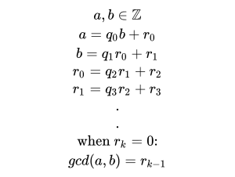

# Divisors
## Definition


> Referring to the [integer division algorithm](../integer_division), we only use the remainder. We stop when the
> remainder gets to 0, and the GCD is the previus remainder.

#### LaTex code
```latex
a = q_{0}b + r_{0} \\
b = q_{1}r_0+ r_{1} \\
r_{0} = q_{2}r_1 + r_{2} \\
r_{1} = q_{3}r_2 + r_{3} \\
. \\ .
```