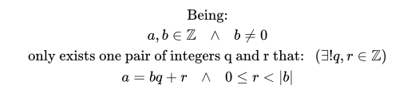
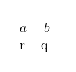

# Integer division
## Definition


#### Common division representation


#### LaTex definition:
```latex
\text{Being:} \\
a, b \in \mathbb{Z}\hspace{10px}\wedge\hspace{10px} b \neq 0 \\
\text{only exists one pair of integers q and r that:} \hspace{10px} (\exists !q, r \in \mathbb{Z}) \\
a = bq + r \hspace{10px}\wedge\hspace{10px} 0 \leq r < |b|
```
