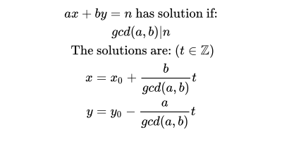

# Divisors
## Definition


#### LaTex code
```latex
ax + by = n \text{ has solution if:}\\
gcd(a, b) | n \\
\text{ The solutions are: (}  t\in \mathbb{Z}\text{)}\\
x = x_0 + \dfrac{b}{gcd(a,b)}t\\
y = y_0 - \dfrac{a}{gcd(a,b)}t \\

```