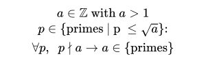

# Sieve of Eratosthenes
## Definition

#### LaTex code
```latex
a \in \mathbb{Z} \text{ with } a > 1\\
p \in \text{\{primes | p } \leq \sqrt a \text{\}:} \\
\forall p, \hspace{.2cm}  p \nmid a \rightarrow a \in \text{\{primes\}}
```
## How it was implemented?
Detailed explanation [here](https://en.wikipedia.org/wiki/Sieve_of_Eratosthenes#Overview).